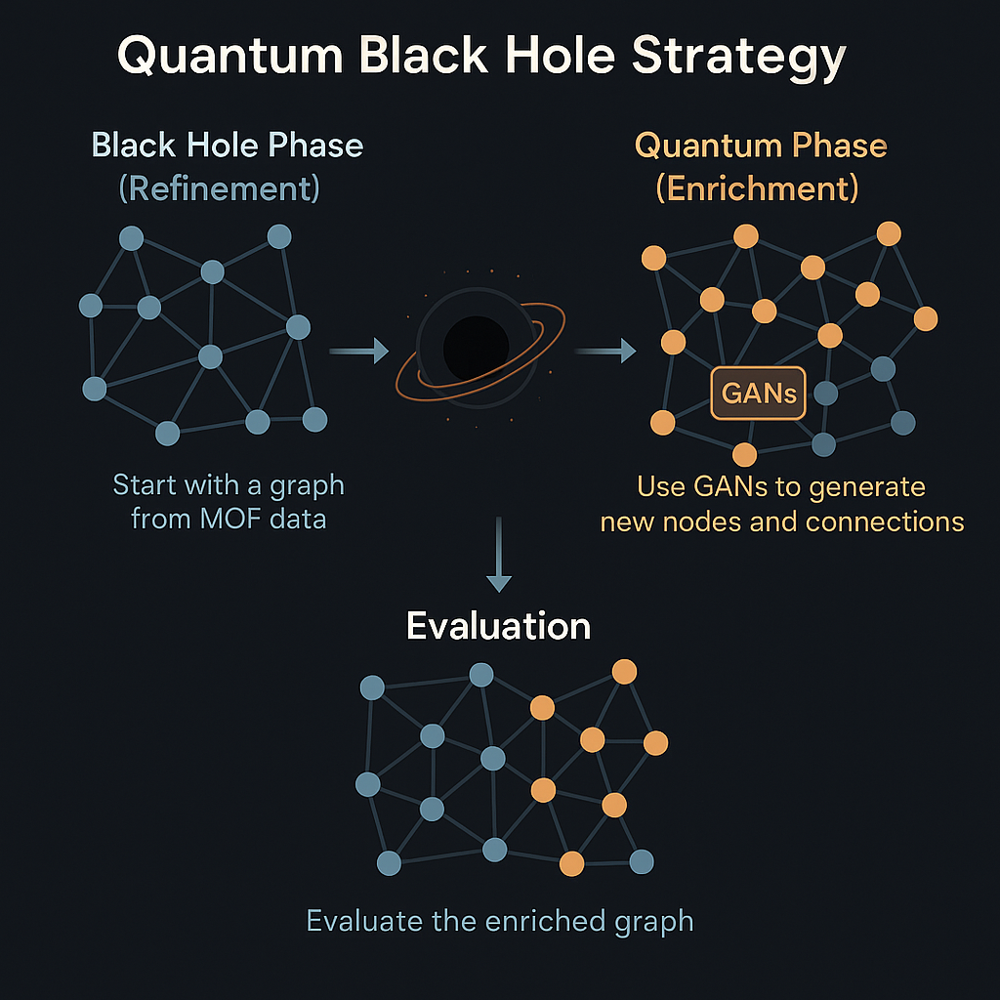

# 🌌 Quantum Black Hole Strategy

The **Quantum Black Hole Strategy** is a cutting-edge, two-phase methodology for transforming large-scale graph datasets into highly efficient, enriched, and insightful representations. By combining **graph refinement** (Black Hole Phase) with **generative enrichment** (Quantum Phase), this approach optimizes datasets for advanced machine learning applications, particularly for **Metal-Organic Framework (MOF)** datasets.

<div align="center">
  
  <p><em>Visualizing the Quantum Black Hole Strategy: From raw data to a refined and enriched graph.</em></p>
</div>

## 📖 Overview

The **Quantum Black Hole Strategy** is designed to address the challenges of working with complex, high-dimensional graph datasets. It leverages a two-step process to:
1. **Simplify** the graph by removing noise and redundant information (Black Hole Phase).
2. **Enhance** the graph with intelligent, synthetic data using generative models (Quantum Phase).

This cyclical approach ensures that the resulting graph is both **compact** and **comprehensive**, making it ideal for tasks like classification, regression, or clustering in domains such as materials science, chemistry, and beyond.

---

## 🕳️ Black Hole Phase: Graph Refinement

The **Black Hole Phase** focuses on **sparsifying** and **refining** the input graph to retain only the most meaningful components. Here's how it works:

1. **Graph Construction**:
   - **Nodes**: Represent individual entities, such as MOFs, with attributes like structural or chemical properties.
   - **Edges**: Capture similarities between entities (e.g., topological similarity, chemical composition, or functional relationships).

2. **Sparsification**:
   - Apply graph pruning techniques to remove:
     - **Low-relevance nodes**: Entities with minimal impact on the overall structure.
     - **Weak edges**: Connections with low similarity or significance.
   - Use algorithms like **k-core decomposition**, **minimum spanning trees**, or **threshold-based filtering** to prioritize high-value components.

3. **Outcome**:
   - A **lean, high-quality graph** that preserves critical relationships while reducing computational complexity and noise.

🔍 **Why it matters**: This phase ensures that downstream machine learning models focus on the most relevant data, improving efficiency and performance.

---

## ⚛️ Quantum Phase: Generative Enrichment

The **Quantum Phase** builds on the refined graph by adding **synthetic nodes and edges** to enhance its richness and utility. Here's the process:

1. **Generative Modeling**:
   - Employ **Generative Adversarial Networks (GANs)** or other generative models (e.g., Variational Autoencoders) to create new nodes and edges.
   - Generate synthetic data that aligns with the statistical and structural properties of the refined graph.

2. **Enrichment**:
   - Introduce **diverse, high-quality connections** to capture latent relationships not present in the original dataset.
   - Enhance node features with synthetic attributes, such as predicted chemical properties or structural variations.

3. **Outcome**:
   - A **richer, more comprehensive graph** that balances compactness with diversity, enabling more robust machine learning models.

✨ **Why it matters**: The Quantum Phase ensures the dataset is not only compact but also versatile, supporting a wider range of applications and improving generalization.

---

## 📊 Evaluation and Validation

To ensure the **Quantum Black Hole Strategy** delivers high-quality results, rigorous evaluation is key. The process includes:

1. **Graph Comparison**:
   - Analyze the **original**, **sparsified**, and **enriched** graphs based on:
     - **Structural Metrics**: Degree distribution, clustering coefficient, centrality measures.
     - **Topological Properties**: Connectedness, diameter, and modularity.
     - **Feature Diversity**: Variance and distribution of node/edge attributes.

2. **Performance Metrics**:
   - Evaluate the enriched graph's impact on downstream tasks, such as:
     - **Classification**: Accuracy, F1-score, or AUC for predicting MOF properties.
     - **Regression**: Mean squared error or R² for quantitative predictions.
     - **Clustering**: Silhouette score or modularity for grouping similar MOFs.

3. **Quality of Enrichment**:
   - Assess whether synthetic nodes and edges:
     - Improve model performance.
     - Maintain or enhance dataset diversity.
     - Preserve domain-specific constraints (e.g., chemical validity for MOFs).

✅ **Goal**: Ensure the strategy produces **better data**—not just more data—that drives meaningful insights and performance gains.

---

## 🛠️ Implementation

The **Quantum Black Hole Strategy** can be implemented using a variety of tools and frameworks. Below is a sample workflow:

1. **Graph Construction**:
   - Use libraries like **NetworkX** or **PyTorch Geometric** to build the initial MOF graph.
   - Compute similarity metrics (e.g., Tanimoto similarity for chemical structures) to define edges.

2. **Black Hole Phase**:
   - Apply graph sparsification algorithms available in **NetworkX**, **Graph-tool**, or custom implementations.
   - Example: Use **k-core decomposition** to retain high-degree nodes and edges.

3. **Quantum Phase**:
   - Train a **GraphGAN** or **GraphVAE** to generate synthetic nodes and edges.
   - Integrate synthetic data into the graph while preserving structural integrity.

4. **Evaluation**:
   - Use **scikit-learn** or **PyTorch** for downstream task evaluation.
   - Visualize graphs with **Matplotlib**, **Plotly**, or **Gephi** for qualitative analysis.

📂 **Code Example**: Check the `examples/` directory for sample implementations in Python.

---

## 🚀 Why Use the Quantum Black Hole Strategy?

The **Quantum Black Hole Strategy** offers a powerful, scalable approach to graph dataset optimization. Key benefits include:

- **Efficiency**: Reduces computational overhead by focusing on high-value data.
- **Flexibility**: Generates diverse, synthetic data to support a wide range of applications.
- **Scalability**: Handles large-scale graphs, such as MOF datasets with thousands of nodes.
- **Performance**: Enhances the quality of data for better machine learning outcomes.

This strategy is particularly well-suited for domains like **materials science**, **drug discovery**, and **network analysis**, where graph-based representations are critical.

---

## 📚 Getting Started

To get started with the **Quantum Black Hole Strategy**:

1. **Clone the Repository**:
   ```bash
   git clone https://github.com/your-repo/quantum-black-hole-strategy.git
   ```

2. **Install Dependencies**:
   ```bash
   pip install -r requirements.txt
   ```

3. **Explore Examples**:
   - Check the `examples/` folder for sample datasets and scripts.
   - Run `python examples/mof_graph_refinement.py` to see the Black Hole Phase in action.

4. **Contribute**:
   - We welcome contributions! See `CONTRIBUTING.md` for guidelines.


---

<div align="center">
  <p><strong>Transform your data. Unleash its potential. 🌌</strong></p>
  <p>Built with ❤️ by [Your Team/Organization]</p>
</div>
